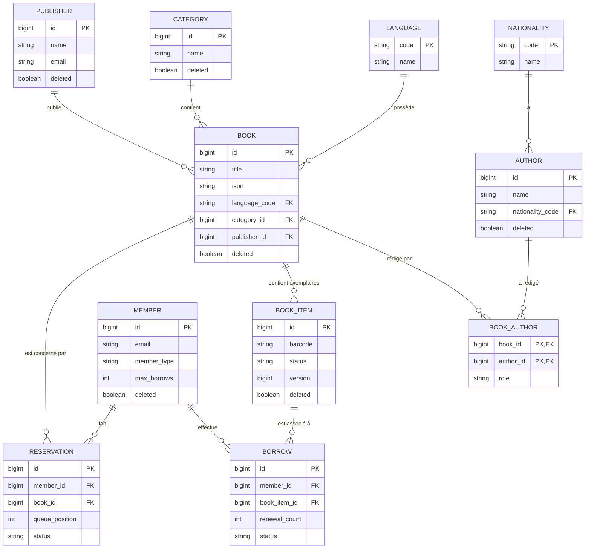

# Système de Gestion de Bibliothèque (Backend REST API)

Bienvenue sur le projet de gestion de bibliothèque ! Ce projet consiste à développer un backend moderne avec **Java, Spring Boot et PostgreSQL/MySQL**.

Pour comprendre les concepts et règles métiers clés du projet, vous pouvez consulter la [📄 Documentation Fonctionnelle](./description.md).


## 👥 Équipe de Développement

Ce projet est découpé et organisé en tâches réparties entre 5 membres de l'équipe :
- **Matricule 24068 (Leader)** : Architecture, Sécurité (Spring Security), Gestion Globale des Exceptions.
- **Matricule 24139** : Entités de références (Category, Author, Publisher) et CRUD basique.
- **Matricule 24238** : Gestion des Livres (Book) et Exemplaires (BookItem), Optimistic Locking.
- **Matricule 24014** : Gestion des Membres (Member) et des Emprunts (Borrow), Limites métiers.
- **Matricule 24157** : Gestion des Réservations (Reservation), File d'attente, Validations complexes.

Chaque membre possède un fichier `[Matricule].md` dans ce dépôt qui détaille le code et les tâches qu'il doit accomplir.

## 📊 Modèle Conceptuel de Données (MCD)

Le diagramme suivant représente la structure de la base de données et les relations entre les tables :



## ⚙️ Profils de Configuration

Le projet utilise **3 profils Spring** pour s'adapter aux différents environnements :

| Profil | Base de données | Port | Usage |
|--------|---------------|------|-------|
| `dev` (défaut) | MySQL local (`library_db`) | `8081` | Développement local |
| `prod` | PostgreSQL (via variables d'env) | `$PORT` ou `8080` | Déploiement (Render) |
| `test` | H2 (base mémoire) | - | Tests unitaires |

### 🔧 Profil `dev` (MySQL)

Fichier : `src/main/resources/application-dev.properties`

```properties
spring.datasource.url=jdbc:mysql://localhost:3306/library_db?createDatabaseIfNotExist=true&useSSL=false&serverTimezone=UTC&allowPublicKeyRetrieval=true
spring.datasource.username=supnum
spring.datasource.password=Supnum
spring.datasource.driver-class-name=com.mysql.cj.jdbc.Driver
spring.jpa.hibernate.ddl-auto=update
server.port=8081
```

**Détails :**
- **URL** : Se connecte sur `localhost` au port `3306`. La base `library_db` est créée automatiquement.
- **User** : `supnum` / **Password** : `Supnum`
- **DDL** : `update` (Hibernate synchronise automatiquement le schéma)
- Des données de démo sont chargées via `data-dev.sql`

### ☁️ Profil `prod` (PostgreSQL)

Fichier : `src/main/resources/application-prod.properties`

```properties
spring.datasource.url=jdbc:${SPRING_DATASOURCE_URL}
spring.datasource.username=${SPRING_DATASOURCE_USERNAME}
spring.datasource.password=${SPRING_DATASOURCE_PASSWORD}
spring.datasource.driver-class-name=org.postgresql.Driver
spring.jpa.hibernate.ddl-auto=update
server.port=${PORT:8080}
```

### 🧪 Profil `test` (H2)

Fichier : `src/test/resources/application-test.properties`

```properties
spring.datasource.url=jdbc:h2:mem:library_test;MODE=MySQL
spring.jpa.hibernate.ddl-auto=create-drop
```

## 🔐 Authentification JWT

Le projet utilise **JWT (JSON Web Tokens)** pour sécuriser l'API :

- **Login** : `POST /api/auth/login` (public) — retourne un token Bearer
- **Requêtes authentifiées** : toutes les autres requêtes nécessitent un en-tête `Authorization: Bearer <token>`
- **Rôles** : `ADMIN` (accès `/api/admin/**`) et `USER`
- Les mots de passe sont hachés avec **BCrypt**

### Utilisateurs pré-configurés

| Username | Rôle |
|----------|------|
| `abdy` | ADMIN |
| `hassen` | USER |
| `baba` | USER |
| `haja` | USER |
| `abdselam` | USER |

## 🚀 Lancement du projet

### Local (profil dev)
```bash
# 1. Démarrer MySQL
docker compose up -d mysql

# 2. Lancer l'application
./mvnw spring-boot:run -Dspring-boot.run.profiles=dev
```

L'API est accessible sur : `http://localhost:8081`

### Déploiement (profil prod)
```bash
# Build
./mvnw clean package -DskipTests

# Lancer avec les vars d'env PostgreSQL
java -jar target/Library-0.0.1-SNAPSHOT.jar --spring.profiles.active=prod
```

Bon développement à toute l'équipe ! Lisez vos fichiers Markdown personnels pour démarrer.

## Contributions & Workflow Git

Salut l'équipe 👋

Voici comment on va travailler ensemble sur le projet. Lisez bien avant de commencer à coder.

──────────────────────────
🔧 WORKFLOW À SUIVRE
──────────────────────────

1️⃣ Récupérer le projet
```bash
git clone <lien-du-repo>
cd <nom-du-repo>
```

2️⃣ Créer votre branche (OBLIGATOIRE)
```bash
git checkout -b feature/votre-nom
```
Exemple : `git checkout -b feature/taches-24139`

2️⃣ bis — Se mettre à jour depuis main (important !)

Faites ça régulièrement pour éviter les conflits avec le travail des autres :
```bash
git checkout main
git pull origin main
git checkout feature/votre-branche
git merge main
```

3️⃣ Coder + committer
```bash
git add .
git commit -m "Description de ce que vous avez fait"
```

4️⃣ Pusher votre branche
```bash
git push origin feature/votre-nom
```

5️⃣ Ouvrir une Pull Request sur GitHub
→ Allez sur le repo GitHub
→ Cliquez sur "Compare & pull request"
→ Décrivez ce que vous avez fait
→ Attendez mon approbation

──────────────────────────
⛔ RÈGLES IMPORTANTES
──────────────────────────

❌ Ne jamais pusher directement sur `main`
❌ Ne jamais merger vous-mêmes
✅ Toujours travailler sur votre propre branche
✅ Une PR par fonctionnalité
✅ Se synchroniser avec `main` régulièrement

Si vous avez des questions, contactez le leader.
